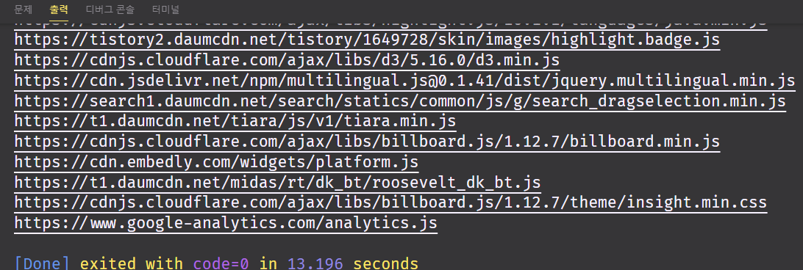
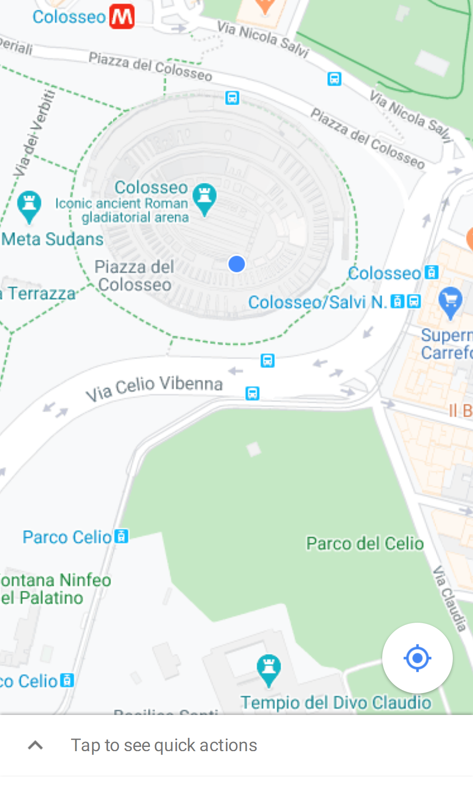

# Playwright

출처: https://qiita.com/mainy/items/3a9de19f440991f67f34?utm_source=Qiita%E3%83%8B%E3%83%A5%E3%83%BC%E3%82%B9&utm_campaign=63313f7bce-Qiita_newsletter_451_02_24_2021&utm_medium=email&utm_term=0_e44feaa081-63313f7bce-34467781

Playwright가 작년에 대폭 파워 업하고 있었기 때문에 사용법을 확인했을 때의 기록의 정리입니다.
브라우저를 자동 조작 할 수 있다는 것은 간단한된다고 나 브라우저 측의 테스트 자동화가 쉽게 할 수 있습니다.

특히 Python으로 설명이 아직도 적었기 때문에 자신의 학습을 포함하여 정리했습니다.
이번에는 입문편 것으로 전체를 파악하면서 사용 방법의 흐름을 확인하여 주시면 감사하겠습니다.

Selenium과 Puppeteer를 사용하는 사람도 한번 볼만한 가치가 있다고 생각합니다.


## 선정 이유

브라우저 테스트를 Python으로 자동화하고 싶었습니다.
제 나름대로의 요구 사항이있어서 매우 변덕스러운 요구사항이지만 여유롭게 모두 클리어했습니다.

- Python으로 쓸 것. 사내에서 Python을 많이 사용할 것이  때문에. pytest와 연계 해주면 더욱 좋겠습니다.
- Docker 컨테이너에서 움직일 것. CI/CD에 내장하고 싶다.
- 비동기로 작동 할 것.
- Windows 환경에서 테스트 코드가 쓰기 쉬운 것. 라고 할까, GUI에서 브라우저 작업하면서 테스트 코드를 자동으로 생성 해 주면 좋겠습니다.
- 스크린 샷을 남길 수 있을것. 증거로 테스트 결과에 쓰고 싶다.


### 또 이런 기능이 있습니다.

- Chromium, Firefox, Webkit의 크로스 브라우저 테스트
- IPhone 및 Android 환경에서의 테스트
- 브라우저의 동작을 비디오 레코딩
- NodeJS C #, Java 지원


## 환경 및 설치

### 작업 환경

- Windows 10 Pro (2004)
- Python 3.9.1

### Playwright 설치

``` cmd
# 설치
pip install playwright==1.8.0a1
playwright install

# 설치 확인
playwright --version
# Version 1.8.0-1611168053000

# 설치 확인
python -m playwright --version
# Version 1.8.0-1611168053000
```

혹시, 다음도 필요할지도 모릅니다 (미확인)
내 환경에서 혹시 영향을주고있는지도 모른다 것을 선택했습니다.
잘못하면 순서가 빠른 순서로 설치를 시도하십시오.
(그래도 잘되지 않으면 코멘트합니다.)

1. WSL2
2. Ubuntu 20.04
3. gow

공식 문서의 도입 단계 정보는 https://playwright.dev/python/docs/intro 에서 확인할 수 있습니다.


---

출처: https://choiseokwon.tistory.com/222?category=247927

## [Playwright](https://github.com/microsoft/playwright-python)

**소개 :** playwright는 원래 [JS 버전](https://github.com/microsoft/playwright)만 있었는데, python버전도 출시가 되었다.

playwright는 chromium, firefox, webkit 오토메이션 툴이다. (macro)

(주로 cross-browser 테스트로 많이 쓰이는 듯)

 

**특징 기능 :**

- action 실행 전 element auto-wait (ex. 지정한 HTML 요소가 나오면 클릭)
- 네트워크 요청받기 / 보내기
- 모바일 디바이스, 권한, 위치 에뮬레이션
- shadow-piercing selector (::shadow, /deep/)
- 파일 업로드 및 다운로드

 

### 1. 설치

``` bash
pip install playwright
python -m playwright install
```

### 2. 사용법

우선 sync(동기), async(비동기) 두 가지 방식 중 선택해서 코딩하면 된다.

동기(synchronous) 처리 : 특정 작업이 끝나면 다음 작업을 처리하는 순차처리 방식

비동기(asynchronous) 처리 : 여러 작업을 처리하도록 예약한 뒤 작업이 끝나면 결과를 받는 방식

 

#### 1. 비동기로 홈페이지를 열어 스크린샷 캡처

[whatsmyuseragent.org](http://whatsmyuseragent.org/) 홈페이지를 열어서 스크린샷으로 저장한다.

``` python
# 비동기
async def main():
    async with async_playwright() as p:
        for browser_type in [p.chromium]:
            browser = await browser_type.launch()
            page = await browser.newPage()
            await page.goto('http://whatsmyuseragent.org/')
            await page.screenshot(path=f'example-{browser_type.name}.png')
            await browser.close()
```


#### 2. 네이버 및 구글 검색기

[waitForSelector](https://playwright.dev/#version=v1.3.0&path=docs%2Fapi.md&q=pagewaitforselectorselector-options) 를 사용하면 원하는 element가 나올 때까지 기다렸다가 스크린샷을 캡처한다.

아래 코드는, naver에 '코로나 19 현황'을 검색하고, google에 'naver'를 검색해서, 결과를 스크린샷으로 저장한다.

```python
pythondef searchGoogle(page, keyword):
    page.goto("https://www.google.com")
    page.type("input[name=q]", keyword)
    page.click("input[type=submit]")
    page.waitForSelector("text=" + keyword)  # 검색 결과 keyword가 나오면 continue
    page.screenshot(path=f'{browser_type.name}-google.png')


def searchNaver(page, keyword):
    page.goto("https://www.naver.com/")
    page.type("input[name=query]", keyword)
    page.click("button[type=submit]")
    page.screenshot(path=f'{browser_type.name}-naver.png')

# 동기
with sync_playwright() as p:
    for browser_type in [p.chromium]:
        browser = browser_type.launch()
        page = browser.newPage()

        searchGoogle(page, "네이버")
        searchNaver(page, "코로나 19 현황")

        browser.close()
```


#### 3. 네트워크 요청 인터셉트

Route 공식 문서 : https://playwright.dev/#version=v1.3.0&path=docs%2Fapi.md&q=pagerouteurl-handler

page.route(url, handler) : url[Regex, string, function, boolean 타입 가능], handler[function Route, Request]

아래 코드는 티스토리 블로그를 열어서 css와 관련 네트워크 요청을 전부 print한다.

```python
pythonwith sync_playwright() as p:
    browser = p.chromium.launch()
    page = browser.newPage()

    def log_and_continue_request(route, request):
        print(request.url)
        route.continue_()

    # Network 요청 전부 로깅
    page.route('.*?[.css]', lambda route,
               request: log_and_continue_request(route, request))

    page.goto('https://choiseokwon.tistory.com/')
    browser.close()
```





 

\4. 모바일 환경 구글 맵 에뮬

지원 기기 목록 : https://github.com/Microsoft/playwright/blob/master/src/deviceDescriptors.ts

[waitForRequest 문서 열기](https://playwright.dev/#version=v1.3.0&path=docs%2Fapi.md&q=pagewaitforrequesturlorpredicate-options)

아래 코드는, 동기, iPhone 11 Pro로 구글 맵에 콜로세움 위치를 입력해서 스크린샷으로 저장

```python
pythonwith sync_playwright() as p:
    iphone_11 = p.devices['iPhone 11 Pro']
    browser = p.webkit.launch(headless=False)
    context = browser.newContext(
        **iphone_11,
        locale='en-US',
        geolocation={'longitude': 12.492507, 'latitude': 41.889938},
        permissions=['geolocation']
    )
    page = context.newPage()
    page.goto('https://www.google.com/maps/')
    page.click('text="Your location"')
    page.waitForRequest(".*[Colosseo]")
    page.screenshot(path='colosseum-iphone.png')
    browser.close()
```




React Playwright : https://github.com/KyleADay/react-app-playwright#why-playwright

Playwright 공식 문서 : https://playwright.dev/#


---

## 로그인 뒤 스크래핑

출처: https://theheadless.dev/posts/scraping-example-purchases/

Puppeteer 및 Playwright는 로그인 벽 뒤에서 만 액세스 할 수있는 데이터를 스크랩 할 때 특히 유용 할 수 있습니다. 이 기사는 그러한 사례의 실제 예를 보여줍니다.

### 아마존의 스크래핑 비용

예를 들어, Amazon 계정에 로그인하여 전년도의 각 주문에서 가격을 긁어 낸 다음 모두 합산하여 해당 기간 동안의 총 아마존 지출을 보여줍니다.

UI 자동화와 스크래핑을 결합하면 먼저 플랫폼에 로그인 한 다음 모든 주문에 대한 정보를 검색 할 수 있습니다.

`puppeteer 예제`

``` javascript
const puppeteer = require('puppeteer');
(async () => {
  const currency = process.env.CURRENCY
  const amazonUrl = process.env.AMAZON_URL
  const amazonUser = process.env.AMAZON_USER
  const amazonPassword = process.env.AMAZON_PASSWORD

  const browser = await puppeteer.launch()
  const page = await browser.newPage()

  await page.goto(amazonUrl)

  await page.setViewport({ width: 1200, height: 1822 })

  await page.waitForSelector('#nav-signin-tooltip > .nav-action-button > .nav-action-inner')
  await page.click(' #nav-signin-tooltip > .nav-action-button > .nav-action-inner')

  await page.waitForSelector('#ap_email')
  await page.type('#ap_email', amazonUser)

  await page.click('#continue')

  await page.waitForSelector('#ap_password')
  await page.type('#ap_password', amazonPassword)

  await page.click('#signInSubmit')

  await page.waitForSelector('#nav-link-accountList > .nav-long-width')
  await page.click('#nav-link-accountList > .nav-long-width')

  await page.waitForSelector('.ya-card__whole-card-link > .a-box > .a-box-inner > .a-row > .a-column > div')
  await page.click('.ya-card__whole-card-link > .a-box > .a-box-inner > .a-row > .a-column > div')

  await page.waitForSelector('#a-autoid-1-announce > .a-dropdown-prompt')
  await page.click('#a-autoid-1-announce > .a-dropdown-prompt')

  await page.waitForSelector('#orderFilter_2')
  await page.click('#orderFilter_2')

  let filteredPrices = []
  let prices = []

  await page.waitForSelector('.a-normal')
  const pages = await page.$$('.a-normal')

  for (const singlePage of pages) {
    await page.waitForSelector('.a-last')
    prices = await page.$$eval(
      '.a-column:nth-child(2) .a-color-secondary.value',
      (nodes) => nodes.map((n) => n.innerText)
    )

    filteredPrices = filteredPrices.concat(
      prices.filter((price) => price.includes(currency))
    )
    await page.waitForSelector('li.a-last')
    await page.click('li.a-last')
  }

  const cleanPrices = filteredPrices.map((x) => {
    return x.replace(',', '.').replace(/[^\d.,-]/g, '')
  })

  const totalExpense = cleanPrices.reduce((a, b) => parseFloat(a) + parseFloat(b), 0)
  console.log(`Total expense for the year: ${currency} ${totalExpense}`)

  await browser.close()
})()
```


`playwright 예제`

``` javascript
const { chromium } = require('playwright');
(async () => {
  const currency = process.env.CURRENCY
  const amazonUrl = process.env.AMAZON_URL
  const amazonUser = process.env.AMAZON_USER
  const amazonPassword = process.env.AMAZON_PASSWORD

  const browser = await chromium.launch()
  const page = await browser.newPage()

  await page.goto(amazonUrl)

  await page.setViewportSize({ width: 1200, height: 1822 })

  await page.click(
    '#nav-signin-tooltip > .nav-action-button > .nav-action-inner'
  )

  await page.type('#ap_email', amazonUser)
  await page.click('#continue')
  await page.type('#ap_password', amazonPassword)

  await page.click('#signInSubmit')

  await page.click('#nav-link-accountList > .nav-long-width')

  await page.click('.ya-card__whole-card-link > .a-box > .a-box-inner > .a-row > .a-column > div')

  await page.click('#a-autoid-1-announce > .a-dropdown-prompt')

  await page.click('#orderFilter_2')

  let filteredPrices = []
  let prices = []

  await page.waitForSelector('.a-normal')
  const pages = await page.$$('.a-normal')

  for (const singlePage of pages) {
    await page.waitForSelector('.a-last')
    prices = await page.$$eval(
      '.a-column:nth-child(2) .a-color-secondary.value',
      (nodes) => nodes.map((n) => n.innerText)
    )

    filteredPrices = filteredPrices.concat(
      prices.filter((price) => price.includes(currency))
    )
    await page.waitForSelector('li.a-last')
    await page.click('li.a-last')
  }

  const cleanPrices = filteredPrices.map((x) => {
    return x.replace(',', '.').replace(/[^\d.,-]/g, '')
  })

  const totalExpense = cleanPrices.reduce((a, b) => parseFloat(a) + parseFloat(b), 0)
  console.log(`Total expense for the year: ${currency} ${totalExpense}`)

  await browser.close()
})()
```

