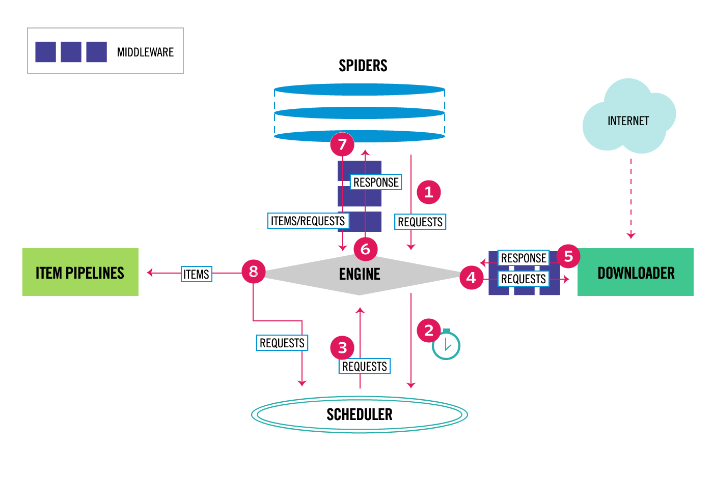

# Scrapy 간단 사용법

출처: https://python-world.tistory.com/entry/Simple-Scrapy


## 설치

``` bash
$ pip install scrapy
```


## 프로젝트 생성

``` bash
$ scrapy startproject project_name
```

아래와 같이 디렉토리와 파일들이 생성됨

``` bash
$ tree project_name
project_name
├── scrapy.cfg
└── project_name
    ├── __init__.py
    ├── items.py
    ├── middlewares.py
    ├── pipelines.py
    ├── settings.py
    └── spiders
        └── __init__.py
```


## 간단 spider 생성

Spiders 디렉토리 안에 파이썬 파일 생성

``` bash
$ cd project_name/project_name/spiders
$ touch example.py
```

`scrapy.Spider`를 상속하는 클래스를 생성

``` python
# example.py
import scrapy

class ExampleSpider(scrapy.Spider):
    name = 'example'

    def start_requests(self):
        urls = [
            'http://www.example.com/'
        ]

        return [scrapy.Request(url=url, callback=self.parse) for url in urls]
        # 또는
        #for url in urls
        #    yield scrapy.Reqest(url=url, callback=self.parse

    def parse(self, response):
        url = response.url
        title = response.css('h1::text').get()
        print(f'URL is: {url}')
        print(f'Title is: {title}')
```

- name (필수)
  spider 이름을 지정. 프로젝트 안에서 유일한 이름이어야 함.
- start_requests(self) (필수)
  - spider 시작 시 실행되는 메서드로 `scrapy.Request()`를 사용하여 `Request` 오브젝트를 만들어 리턴하면 Scrapy 스케쥴러에(queue) 등록되고 순서가 되면 Scrapy `downloader`가 파라미터로 전달된 url을 사용하여 페이지를 요청.
  - `callback` 파라미터를 사용하여 `downloader`가 전달해 주는 `Response` 오브젝트를 처리할 메서드를 지정.
  - 이 메서드는 spider 시작 시 한번만 실행되기 때문에 위와 같이 `Request` 오브젝트를 리스트 형식으로 만들어 리턴하거나 `yield`를 사용하여 generator 형식으로 사용
- [scrapy.Request()](https://docs.scrapy.org/en/latest/topics/request-response.html)
  `Request` 오브젝트를 만들기 위해 사용.
  - url
    요청할 사이트 주소 http 형식
  - callback
    `Response` 오브젝트를 처리할 메서드를 지정
- `parse(self, response)` (필수)
  - Response`오브젝트를 처리하는 callback 메서드로 argument로`Response` 오브젝트를 받음.
  - 위 코드와 같이 `Request` 오브젝트를 만들 때 callback를 사용자가 지정하기 때문에 parse란 이름 대신 다른 이름으로 사용해도 됨.
- `response.css('h1::text').get()`
  [css selector](https://docs.scrapy.org/en/latest/topics/selectors.html)를 사용하여 h1 태그를 찾고 텍스트를 반환


>`$ scrapy genspider [template_name] <spider_name> <domain_name>` 명령을 사용하면 템플릿을 사용하여 자동으로 템플릿에 맞는 클래스가 작성된 `spider_name`으로된 파이썬 파일을 spiders 폴더 안에 만듬.
>클래스는 아래에 있는 코드가 줄여진 형태.
>`$ scrapy genspider -l` 명령으로 사용할 수 있는 템플릿을 확인할 수 있음.


## Scrapy 실행

위에서 정의한 spider를 실행하고 `start_requests` 메서드를 실행함.

```bash
$ scrapy runspider example.py
# 또는 
# scrapy crawl <spider name>
```


## Spider 코드 줄이기

``` python
# example.py
import scrapy

class ExampleSpider(scrapy.Spider):
    name = 'example'
    start_urls = [
        'http://www.example.com/'
    ]

    def parse(self, response):
        url = response.url
        title = response.css('h1::text').get()
        print(f'URL is: {url}')
        print(f'Title is: {title}')
```

- `start_requests` 메서드 대신 `start_urls`를 사용하면 spider가 시작 될 때 알아서 작성된 URL을 사용하여 `Request` 오브젝트를 생성하고 리턴.
- callback으로 `self.parse` 메서드를 사용하기 때문에 이름을 변경하면 안됨.


## [Item](https://docs.scrapy.org/en/latest/topics/items.html) 사용하기

Crawl한 페이지에서 원하는 데이터를 추출한 후 구조적으로 저장하기 위해 사용.
`Item`이라는 오브젝트에 attribute 형태로 데이터가 저장되고 원할 경우 이 데이터를 JSON이나 CSV 같이 파일로 저장할 수 있음.


> 물론 파이썬에서 제공하는 `open` 모듈을 사용하여 parsing 단계에서 파일 형태로 저장할 수 있지만 이런 수고로움 없이 Scrapy에서 편리하게 사용할 수 있는 방법을 제공. 또한 많은 양의 데이터를 파일로 저장할 경우 I/O 병목이나 오버헤드 또는 쓰레드 처리 등등 여러가지 문제들이 발생할 수 있기 때문에 심신의 안정과 평안을 얻기 위해서도 Scrapy에서 제공하는 방법을 사용. 근본적으로 framework를 사용하는 이유이기도……

보통 `items.py`에 클래스를 정의(그냥 spyder가 정의된 파일에 같이 사용해도 되나 편의상 구분하여 정의) 클래스는 `scrapy.Item`을 상속해야 하고 데이터들을 저장할 필드를 `scrapy.Filed` 오브젝트로 만듬.

`example` 스파이더를 item을 사용하게 변경 하면

``` python
# items.py
import scrapy

class ExampleItem(scrapy.Item):
    url = scrapy.Field()
    title = scrapy.Field()

# example.py
import scrapy
from ..items import ExampleItem  # 위에서 정의한 클래스 import

class ExampleSpider(scrapy.Spider):
    name = 'example'
    start_urls = [
        'http://www.example.com/'
    ]

    def parse(self, response):
        example_item = ExampleItem()        # Item 오브젝트 생성
        example_item['url'] = response.url  # 데이터 저장
        example_item['title'] = response.css('h1::text').get()

        return example_item
```

처음 작성한 코드와 다른 점은 `Item` 오브젝트는 반드시 리턴되어야 한다는 것이다.
처음 작성한 코드는 명시적으로 데이터를 출력하게 한것이고, 여기서는 오브젝트를 리턴해야 로그에 데이터가 출력도 되고 나중에 파일로 저장될 때 사용되어 진다.

> Django를 경험해 본 사람은 item이 Django의 Model과 비슷한걸 느낄 것이다. 실제로 Scrapy 문서에도 유사하다고 나와 있다.


## Item 파일로 저장하기

``` bash
$ scrapy runspider examle.py -o example.csv -t csv
$ scrapy runspider examle.py -o example.json -t json
$ scrapy runspider examle.py -o example.xml -t xml
```

`-t` 옵션을 사용하지 않아도 Scrapy가 파일 확장자를 보고 자동으로 확장자에 맞게 저장 해줌.


## Logging 사용하기

CLI에서 Scrapy를 실행하면 실행되는 내용이 출력되는데 내용이 길 경우(보통은 긴 내용이 출력됨) 확인하기가 어렵기 때문에 출력 내용을 파일로 저장해서 확인하면 편함.

아래와 같이 `settings.py`에서 로깅을 설정할 수 있음(CLI에 출력 안됨).

``` python
LOG_FILE = 'spider.log'  # log 파일 위치
LOG_LEVEL = 'INFO'       # 기본은 DEBUG 임
```

또는 Scrapy를 실행 할 때 설정

``` bash
$ scrapy runspider example.py -s LOG_FILE=spider.log
```


## 팁

### 사이트 제한으로 crawling이 안되는 경우

Scrapy를 실행 할 경우 간혹 사이트에서 제한을 걸어 crawling을 못하는 경우가 발생. 왜냐하면 Scrapy는 실행 시 [robots.txt](https://support.google.com/webmasters/answer/6062608?hl=ko) 파일을 확인해서 제한이 걸려 있는 페이지를 crawling 하지 않기 때문.
이 문제를 해결할려면 `settings.py`에서 `ROBOTSTXT_OBEY = True`을 False로 수정하면 됨.

> (주의)그러나 과도하게 사이트에 부하(crawling)를 주면 IP가 차단될 수도 있음.

### 과도한 요청으로 인한 차단을 피하는 방법

과도하게 사이트를 crawling 할 경우 사이트에서(관리가 잘되는 곳)에서 IP를 차단 할 수도 있다. 이를 예방하기 위해 `DOWNLOAD_DELAY`와 `CONCURRENT_REQUESTS` 수정해 요청(request)을 조절할 수 있다.

``` python
# settings.py
DOWNLOAD_DELAY = 0.25    # 250ms 기다림, 기본값은 안기다림
CONCURRENT_REQUESTS = 1  # 기본값은 16
```

위 설정은 한 개의 request 후 0.25초를 기다림

- `DOWNLOAD_DELAY`은 request 후 얼마를 기다릴 지 설정
- `CONCURRENT_REQUESTS`은 한번 request 할 때 동시에 몇개의 request를 할지 설정. 예를 들어 총 100개의 페이지(url)를 요청(request)해야 한다면, 한번 요청할 때 20개 씩 나눠서 요청 할 수 있음.

### HTTP cache를 사용

아래와 같이 `settings.py`에 설정을 하면 cache 기능을 사용할 수 있다.

``` python
# settings.py
HTTPCACHE_ENABLED = True  # 기본 값은 False
```

위와 같이 설정을 하면 한번 request한 페이지 정보들이 프로젝트 디렉토리의 `.scrapy` 안에 저장(cache)되고 다음에 같은 페이지를 request 할 때 cache를 사용하여 속도를 향상 시킬 수 있다.


# Scrapy 구조 알아보기

Scrapy를 잘 사용하기 위해 구조와 작동 순서를 아는것이 필요.

## Components

Scrapy는 아래와 같은 component들로 구성되어 있다.

- Scrapy Engine
  각 component들에 데이터(`Request`, `Response`, `Item`)를 전달(Controller)하고 액션이 발생 했을 때 이벤트를 발생시키는 역활을 함.

- Scheduler
  엔진으로 부터 `Request`을 전달 받고 이 `Request`을 queue에 추가한 후 나중에 엔진이 `Request`를 요청할 때 다시 엔진에 전달.

- Downloader
  `Request`에 포함된 URL에서 웹 페이지를 가져와서 `Response` 오브젝트를 만들어 엔진에게 전달하는 역활을 한다. 엔진은 전달 받은 이 웹 페이지를 다시 스파이더에게 전달.

- Spider
  요청할 URL을 사용하여 `Request` 오브젝트를 만들고, callback 메서드를 사용하여 `Response`에서 원하는 데이터를 추출하거나 `Response`에 포함된 URL을 사용하여 새로운 `Request`를 만드는 역활을 함.

- Item Pipeline
  스파이더로 부터 추출된 아이템을 처리하는 역활을 함(정확히는 `Item` 오브젝트가 전달됨). 일반적으로 아이템을 cleansing, 검증 그리고 데이터베이스 같은 곳에 저장하는 일을 함.

- Downloader middleware

  엔진과 다운로더 사이에 위치한 hook으로 엔진으로 부터 다운로더로 전달되는

   

  ```
  Request
  ```

  를 처리하고, 다운로더로 부터 엔진으로 전달 되는

   

  ```
  Response
  ```

  를 처리.

  아래와 같은 것이 필요할 경우 다운로더 미들웨어를 사용한다.

  - `Request`가 다운로더로 전달되기 전에 처리하기 위해. 예를 들어 웹사이트로 request를 보내기 전에 문제가 없는지 확인하기 위해.
  - `Response`를 스파이더로 전달되기 전에 변경하기 위해.
  - `Response`를 스파이더로 전달하는 대신 새로운 `Request`를 요청하기 위해.
  - 웹 페이지를 가져오지 않고 스파이더에 `Response`를 전달하기 위해.
  - 몇몇 `Request`를 drop하기 위해.

- Spider middleware

  엔진과 스파이더 사이에 위치한 hook으로 스파이더의 input(

  ```
  Reponse
  ```

  )와 output(아이템과

   

  ```
  Request
  ```

  )를 처리할 수 있다.

  아래와 같은 경우가 필요할 때 사용

  - 스파이더 콜백의 아웃풋인 `Request`와 아이템를 변경하거나 추가, 삭제.
  - `start_requests`의 후처리
  - 스파이터의 예외 처리
  - `Response`을 기반으로 `Request`들 중 일부에 callback을 호출하는 대신 errback를 호출(예를들어 response가 정상(200)이 아닌 경우 callback을 호출하지 않고 errback를 호출하여 처리)

## 데이터 흐름

데이터(request, response, item)이 Scrapy 시스템 안에서 어떻게 흘러 가는지 아래 그림이 설명해 주고 있다.


Scrapy Data Flow


Scrapy에서 데이터는 엔진에 의해서 컨트롤 되고 아래와 같이 흘러 간다.

1. 엔진은 스파이더로 부터 crawl을 하기 위한 초기 `Request` 오브젝트를 받음.
2. 엔진은 이 `Request`를 스케줄러 안에 등록하고 crawl를 진행 할 다음 `Request`를 요청.
3. 스케줄러는 엔진에게 다음으로 crawl을 진행 할 `Request`을 전달.
4. 엔진은 이 `Request`를 다운로더에 전달하고, `Request`는 다운로더로 전달되면서 다운로더 미들웨어를 거쳐 감. 내부적으로는 미들웨어의 `process_request()`를 실행.
5. 다운로더는 `Request` 오브젝트에 포함되어 있는 URL의 페이지를 가져(fetch) 온 후 이 페이지를 이용하여 `Response` 오브젝트를 생성하고 엔진에게 다시 전달. `Response`는 엔진으로 전달되면서 다시 다운로더 미들웨어를 거쳐 감. 내부적으로는 미들웨어의 `process_response()`를 실행.
6. 엔진은 다운로더로 부터 `Response`를 전달 받고 이 `Response`를 스파이더에게 전달. `Response`는 스파이더로 전달되면서 스파이더 미들웨어를 거쳐 감. 내부적으로는 미들웨어의 `process_spider_input()`를 실행.
7. 스파이더는 `Response`를 처리하고 스크랩한 아이템과 새로운 `Request`를 엔진에게 전달(`Response`에 포함된 링크를 따라 `Request`를 만들 경우). 스크랩과 새로운 `Request`는 엔진으로 전달되면서 스파이더 미들웨어를 거쳐 감. 내부적으로는 미들웨어의 `process_spider_output()`를 샐행.
8. 엔진은 아이템을 `Item Pipelines`에 전달하고 새로운 `Request`는 스케쥴러에 전달하면서 다음으로 crawl 해야 하는 `Request`를 요청.
9. 이 모든 프로세스는 스케쥴러로 부터 더 이상 `Request`가 없을 때 까지 1번 부터 반복적으로 진행.

위 절차를 요약 하자면,

1. 내가 작성한 스파이더에서 `Request` 오브젝트를 만들어 리턴하면
2. 다운로더가 페이지를 가져와서 `Response` 오브젝트를 만들어 스파이더로 전달해 주고
3. 스파이더는 내가 작성한 callback를 실행해서 내가 원하는 아이템을 추출하고 파이프라인으로 전달.
4. 내가 작성한 파이프라인이 있으면(데이터베이스로 저장 등) 파이프라인에서 아이템을 다시 처리하고 더 이상 `Request`가 없을 때 까지 반복.

`Reqeust`와 `Response`가 전달되는 과정에서 미들웨어들을 거쳐감.
