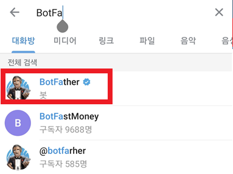
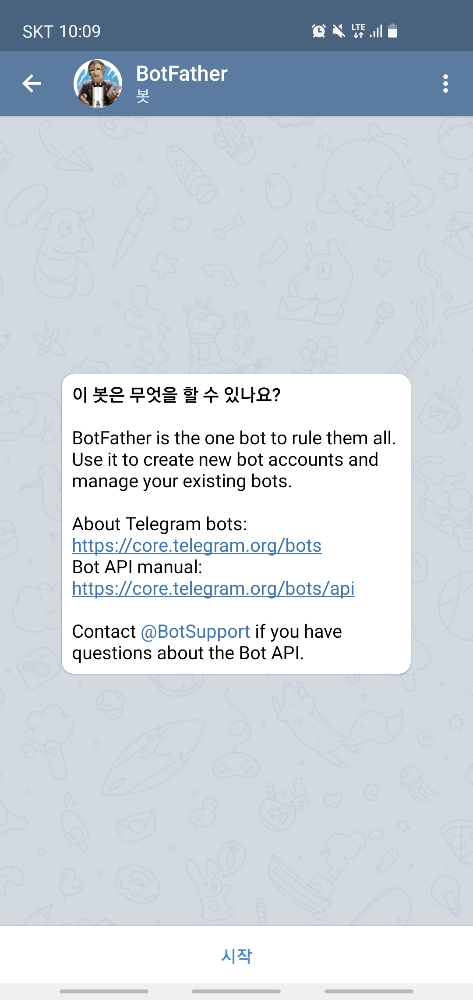
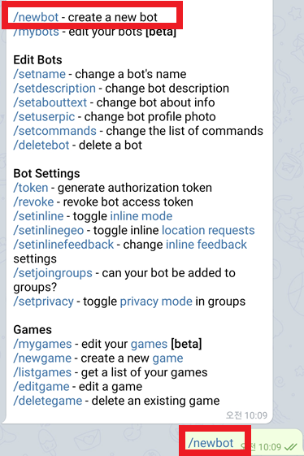
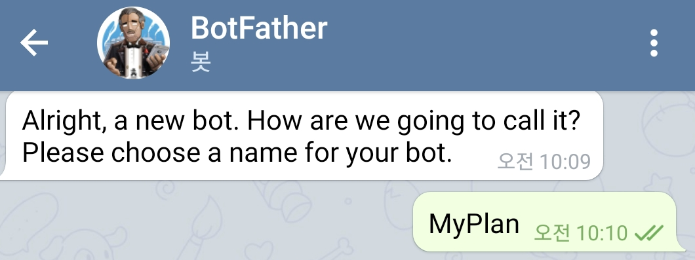
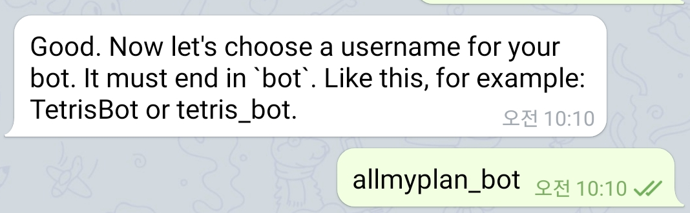
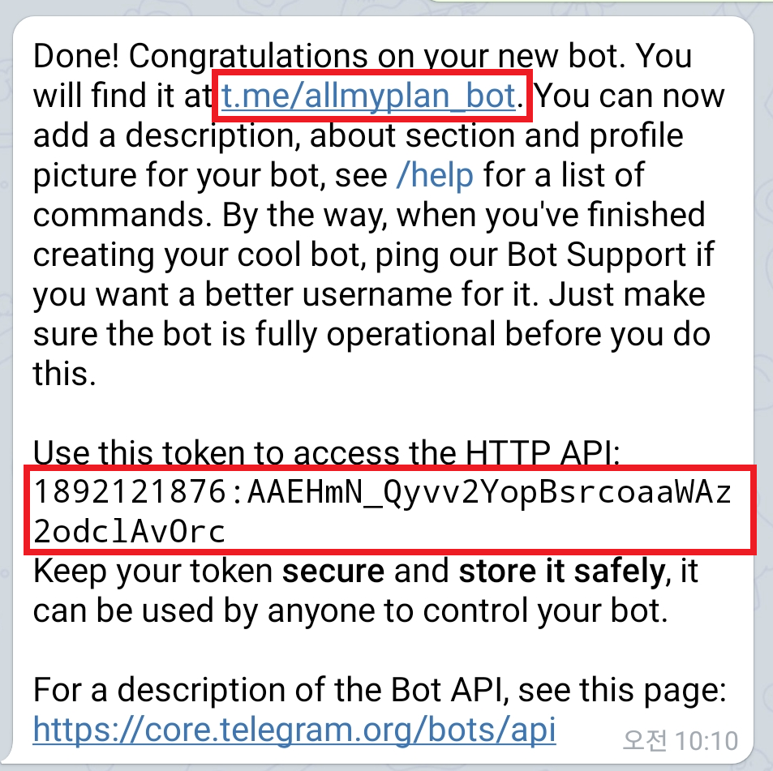
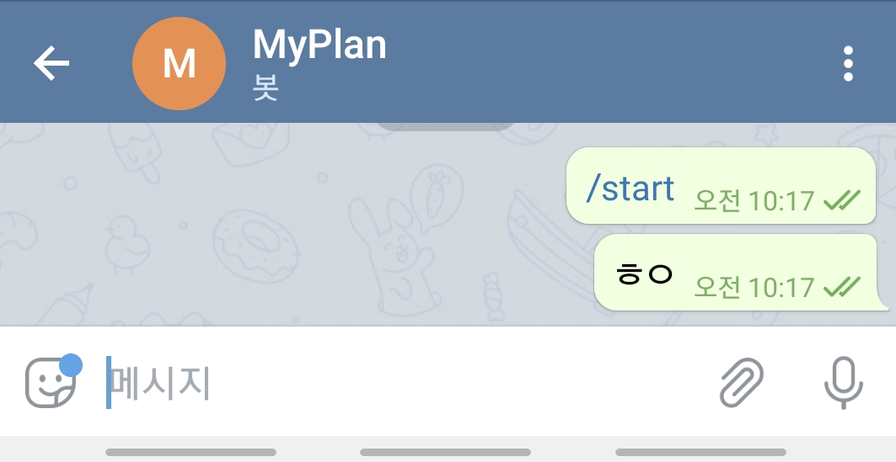
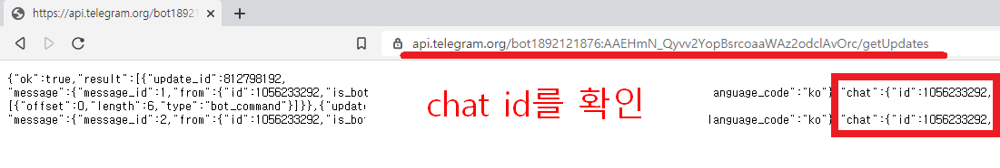
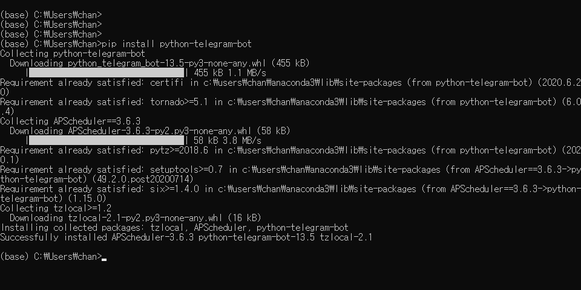
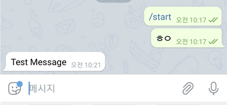

# 파이썬으로 나만의 텔레그램 봇 만들기

출처: https://chancoding.tistory.com/149

파이썬을 활용한 나만의 텔레그램 봇을 만들어보겠습니다.

자신만의 필요한 알림을 위해서나 스케줄 관리를 위해서 텔레그램 봇을 활용할 수 있습니다.

시간이 되면 딱딱 필요한 내용들을 메시지로 보내준다면 편리하겠죠!

------

# **1. 텔레그램 봇 만들기**

핸드폰에서 Google Play Store에서 telegram 앱을 설치해주세요.

telegram을 실행해줍니다.

 

## **1.1 BotFather**

텔레그램 상단의 돋보기 모양을 선택합니다.


`BotFather`를 검색합니다.





 

## **1.2 Bot 생성**





`시작`을 누르면 Telegram 봇 만들기를 시작합니다.

`/newbot`을 누르거나 타이핑해서 메세지를 보냅니다.





 

How are we going to call it? 봇의 이름을 어떻게 정할 것인지 묻습니다.

원하는 이름을 적어주세요.





저는 MyPlan 이라는 이름으로 작성하였습니다.

 

 

Bot의 username을 어떻게 설정할 것인지 묻습니다. Bot의 username을 설정해줍니다.





봇의 경우는 뒤에 `_bot`으로 끝나야합니다.

저는 `allmyplan_bot`으로 설정하였습니다.

 

Done! 이라는 메시지와 함께 해당 봇이 생성되었음을 알려줍니다.





 

## **1.3 Bot 채팅방 입장**

첫 번째 빨간 네모의 링크를 확인해주세요. `t.me/allmyplan_bot`이라는 링크가 생성됩니다.

이는 제가 만든 텔레그램 봇과의 대화창으로 연결되는 링크입니다.

각자 자신이 만든 bot의 username으로 끝나는 링크가 생성되셨을 것입니다.

해당 방으로 입장해서 Test 메시지로 아무 말이나 보내줍니다.

저는 ㅎㅇ라고 보냈습니다.





 

## **1.4 API Access Token 확인**


이제 다시 BotFather와의 대화방으로 돌아와서 두 번째 빨간 네모칸을 확인해주세요.

해당 값이 HTTP API token입니다. 발급받은 것을 복사해줍니다.

해당 Access Token이 있어야 봇에서 메시지를 보내고 확인할 수 있기 때문에 잘 적어줍니다.

또한, 잃어버리거나 외부에 유출로 인해서 해당 bot의 제어권을 뺏길 수 있으니 주의하도록 합니다.

------

# **2. Telegram API - chat_id 확인**

위에서 얻은 api token 값을 가지고 와서 아래의 링크와 합쳐줍니다

**https://api.telegram.org/bot{토큰 값이 들어가는 부분}/getUpdates**

`{토큰 값이 들어가는 부분}` <- 이 부분에 token 값을 붙여 넣습니다.

**example)**

위에서 제가 얻은 token 값을 사용할 경우 아래와 같은 링크가 생성됩니다.

https://api.telegram.org/bot1892121876:AAEHmN_Qyvv2YopBsrcoaaWAz2odclAvOrc/getUpdates

##  

이제 크롬 주소창에 해당 주소를 입력해줍니다.





ok:true api가 잘 작동하는지 확인할 수 있습니다.

다음 chat_id 를 확인합니다. 해당 id값이 있어야 python에서 메시지를 보낼 수 있습니다.

chat_id를 잘 적어놓습니다.

------

# **3. telegram library 설치**

cmd 창으로 이동해서 telegram library를 설치해줍니다.





```
pip install python-telegram-bot
```

위의 명령어를 사용해서 라이브러리를 설치해줍니다.

------

# **4. 메세지 보내기**

이제 파이썬을 사용해서 메세지를 보내보겠습니다.

파이썬을 실행해서 소스코드를 작성해보세요.

bot의 `token`값과 `chat_id`를 여기에서 사용하게 됩니다.

자신의 `token`과 `chat_id`를 입력해주세요.

```
import telegram as tel

bot = tel.Bot(token="1892121876:AAEHmN_Qyvv2YopBsrcoaaWAz2odclAvOrc")
chat_id = 1056233292

bot.sendMessage(chat_id=chat_id, text="Test Message") # 메세지 보내기
```

`sendMessage`를 사용해서 메시지를 보낼 수 있습니다.

봇과의 대화방으로 돌아가 보면 봇이 나이게 메시지를 보낸 것을 확인할 수 있습니다.





`text`에 입력된 문자열이 메시지로 잘 보내졌습니다.

 

수고하셨습니다.

지금까지 텔레그램 봇을 만들고 원하는 메시지를 보내는 것을 모두 마쳤습니다.

이제 자신이 원하는 데이터나 메세지를 작성해서 텔레그램 봇을 통해 데이터를 보낼 수 있습니다.

이제 본인이 원하는 방식에 맞춰서 텔레그램 봇을 활용해보세요~!!

 

다음 글에서는 해당 봇을 사용해서 공모주 일정을 파싱해온 후 일정을 알려주는 봇을 만들어볼 예정입니다.
