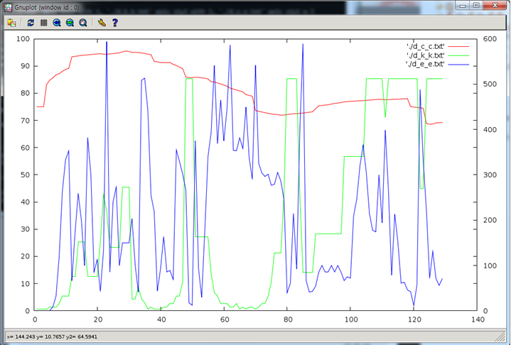

# [gnuplot 사용법](https://blog.naver.com/nai0315/10113430741)

gnuplot 홈페이지에 가보면 - **Gnuplot** is **a portable command-line driven graphing utility** fot linux, OS/2, MS Windows, OSX, VMS, and many other platforms. - 이라고 나와있음.

 

설치 방법은 홈페이지에 나와있고, 실행 방법도 역시-

리눅스에서 gnuplot을 실행하려면 단순히

gnuplot

이라고 치면 됨.

 

먼저 gnuplot을 그리기 위해선 그래프를 그릴 좌표들이 저장되어있는 text파일이 필요함.

파일의 형식은

> \#x좌표[space]y좌표
>
> 3.25 3.0
>
> 2.599 23.11
>
> 0.02 345.23
>
> ..
>
> ..

 이런식으로 x좌표와 y좌표를 space로 구분해서 적어주면 됨. #줄은 주석 처리.

(지금은 단지 2차원 그래프를 그리는 것을 예제로 함. 물론 3차원도 그릴 수 있음!!)

 

그래프를 단순히 그냥 해당 좌표에 점을 찍으려면

> gnuplot> plot 'home/user/a.txt'

라고, plot 뒤에 파일 명을 적어주면 됨.

여기에 점들을 선으로 이어서 꺾은 선 그래프를 만들려면 with l(line이라 해줘도 됨)을 붙여서 적어주면 됨.

> gnuplot> plot 'home/user/a.txt' with l

명령어들은 줄임말로 쓸 수도 있음. 다음과 같이..

- with l = with line = w l = w line = with line
- plot = p
- using = u

 using이라는 것은 x, y, z 등등 좌표의 갯수가 2개를 넘을 때 사용하는 것임. 자세한 사용법은 [참고]에...

 

 

한 화면(?) 안에 그래프를 2개 이상 그리려면 , 로 구분해서 파일 이름을 2개 적어주면 됨.

> gnuplot> plot 'home/user/a.txt' with l, 'home/user/b.txt' with l

 

그래프 마다 y축을 다르게 하려면.. 그니까 y축을 왼쪽 오른쪽 2개로 하려면..(multiaxis)

> gnuplot> set y2tics
>
> gnuplot> set tics nomirror
>
> 

이런 식으로 먼저 setting을 해줌. y축을 2개로 설정한다는 얘기.. 인 듯.

nomirror라는 설정을 안 해주면 왼쪽 y축의 눈금이 오른쪽 y축에도 나타난다는 단점이 있음!!

이제는 그래프를 그려야 하는데, 각 파일 별로 축을 지정해 줘야함.

y축을 2개로 한 것처럼 x축도 2개로 할 수 있는데, 따라서 축 지정은 axis라는 명령어를 사용해서

x1y1, x2y1, x1y2, x2y2 이런 식으로 지정해 주면 됨.

이렇게... (축에 대해서 아무것도 안 적어주면 자동으로 x1y1에 맞춰서 그래프가 그려짐.)

> gnuplot> p 'home/user/a.txt' axis x1y1 with l, 'home/user/b.txt' axis x1y2 with l

그래프를 3개를 그리려면 같은 방식으로 파일명을 3개를 주면 되고

각각 마다 축을 지정해 주면 됨.

 

다음 그림은 그래프 3개를 그렸고 y축 2개로 설정하고, **set nomirror를 안 한 경우의 그래프 그림**

 

오른쪽에 보이는 축에서 왼쪽의 축 눈금까지 같이 보이는 것을 볼 수가 있음.

 

이 외에도 title이라는 명령어를 사용하면 축이나 그래프 자체에 이름을 붙일 수도 있고

축의 경계도 바꿀 수가 있음.

 

자세히 공부하면 리눅스 환경 상에서도 엑셀만큼 편하게 그래프를 그릴 수 있을 듯,

찾아보니 script랑 연동해서 뭔가 할 수 있는 것 같기도..

 

+)  documentation들을 좀 살펴봤는데, gnuplot의 세계는 무궁무진 한 듯.......+_+

