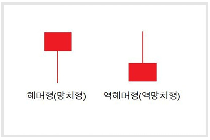

# 기본형 캔들

####   

## 1. 캔들모양 보는법(1)

 

 

**◆ 캔들 기초**                             

 앞으로 설명은 일봉 기준입니다.

 ＊종가(거래종료 후 가격),시가(거래시작 가격)으로 종가가 시가보다 높게 형성되면 빨간색으로 봉이 그려지고 이를 '양봉'이라고 합니다.반대로 종가가 시가보다 낮게 형성되면 파란색으로 봉을 그리고 '음봉'이라 합니다.

 ＊캔들(봉)은 위와 같이 몸통과 꼬리로 표시가되며,윗 꼬리의 끝은 장 중 최고가를 아래 꼬리의 끝은 장 중 최저가를 의미합니다.

 (1) 위 이미지 좌측 빨간색 양봉을 보면 오늘 주가가 시가에서 시작해서 저가를 찍고 다시 상승해서 고가를 찍은 후 조금 하락한 가격인 종가로 끝이 났다고 해석합니다.

(2) 파란색 음봉을 보면 시가에서 시작해서 고가를 찍었다가 다시 하락해 저가를 찍고 조심 상승한 가격인 종가에서 끝이 났다고 해석합니다.

(3) 마지막 가장 우측 십자형 캔들은 거래가 시작한 후 고가와 저가를 찍고 마지막으로 결정 된 종가가 거래가 된 시가와 같다고 해석하면 됩니다.

---

#### ◆ 장대 양봉

 시가가 저가로 장 시작 후 상승하여 당일 고가로 마감하는 패턴입니다.

 \- 저점에서 이런 장대양봉이 발생하면 상승추세 전환을 알리는 신호로 해석합니다.

#### **◆ 장대 음봉**                             

 반대로 시가가 최고가로 시작해서 장 중 계속 하락하여 종가로 마감하는 패턴입니다.

 \- 전형적인 하락신호로 이때 거개량을 수반한 장대음봉은 강력한 하락추세로 해석가능합니다.

---

 

#### ◆ 헤머형 (망치형)

 망치모양 캔들

\- 하락추세 중 발생하면 상승추세로 전환될 가능성이 높음

####  **◆ 역헤머형 (역망치형)**                      

꺼꾸로 된 망치모양 캔들

 \- 하락추세 중 발생하면 상승추세로 전환신호

\- 고가권에서 발생하면 단기 조정을 암시합니다.

---

  

 

#### **◆ 교수형 (행잉맨)**                         

 아래꼬리가 달린 음봉 캔들

 \- 상승권에서 발생한다면 하락추세로 반전가능함 암시

\- 저점에서 발생하면 상승전환 신호

 

#### **◆ 유성형**                               

위꼬리가 달린 음봉 캔들

 \- 상승추세 중 발생하면 하락추세 전환

\- 많이 상승한 상승권에서 발생하면 고점으로 생각 조정 암시

\- 하락추세에 발생하면 추가 하락을 암시.

\- 바닥권 세력 매집 초기에 자주 등장하는 캔들 모양

---

 

#### **◆ 비석형 (추세전환 신호)**                    

시가와 종가가 같고 위꼬리를 만든 캔틀 모양

\- 바닥권에서 비석형 캔들이 연속해서 출현한다면 저점을 이탈하지 않으면서 세력 매집중이라 해석

\- 고점권에서 비석형 캔들이 발생하면 상투가 임박했다는 신호.하락 경고

 

#### **◆ 잠자리형**                              

비석형을 뒤짚어 놓은 캔들 모양

\- 고가권에서 발생하면 하락반적 신호

\- 저점에서 출현하면 앞으로 강력한 상승추세 신호

 

 

 

 

**◆ 십자형 (추세전환 신호)**                    

십자형 캔들 모양

 \- 매수세와 매도세가 힘의 균형을 이룬 상태로 앞으로 추세 전환 신호

\- 상승중에 발생하면 하락추세로 돌아설 가능성이 있음.주의

\- 하락중에 발생하면 상승추세로 돌아설 가능성이 있음.주의

 

 

 

 

 

 

#### **◆ 갭**                                  

＊상승갭: 전일 고가보다 금일 시가가 높은 경우

＊하락갭: 전일 저가보다 금일 시가가 낮은 경우

 

\- 갭이 등장하면 일시적인 호재 OR 악재로 해석하며 매수 혹은 매도 한쪽으로 크게 집중됨

\- 상승갭은 매수세가 매우 강함 해석

\- 하락갭은 매도세가 매우 강함 해석

## 2. 상승반전형 캔들 패턴 보는법(2)

## 20.캔들모양 보는법(1)

 

 

 

상승반전형 캔들 패턴 보는법 2편입니다.가장 기초적인 내용은 하단 1편을 참고해주세요.

cf.캔들모양 보는법 1편 [링크]

 

#### **◆ 역망치형**                             

망치를 엎어놓은 캔들

\- 하락추세에 나온 역망치형은 몸통이 길수록 더 강력한 반등 암시

 

#### **◆ 망치형**                               

망치모양 캔들

\- 양봉일수록,몸통의 길이가 짧을수록,꼬리가 길수록 더 강한 암시

 

 

 

 

 

#### **◆ 상승 샅바형**                           

\- 반등 암시

 

#### **◆ 적삼병**                               

꼬리가 없거나 짧은 양봉이 세개 연속으로 나오는 패턴

 

\- 전형적인 상승 반등 패턴

 

 

 

 

 

#### **◆ 상승장악형**                            

저날 음봉을 다음날 긴 양봉으로 감싸는 형태

 

\- 두번째 양봉에 거래량도 터지면 강한 반등 암시

 

#### **◆ 상승잉태형**                            

전날 긴 음봉에 다음날 양봉이 감싸이는 형태

 

\- 이 패턴에서 상승반적이 안나모면 다시 기존 하락추세 강화

 

 

 

 

 

#### **◆ 상승십자잉태형**                         

짧은 양봉이 전날 긴 음봉에 감싸이는 패턴

 

\- 상승전화 가능성은 존재하나 금일 상승하지 못하면 기존 하락추세 강화 예상

 

#### **◆ 상승반격형**                            

종가 전일 종가와 비슷한 패턴

 

\- 상승전화 의미

 

 

 

 

 

 

#### **◆ 관통형**                               

두번째 양봉이 첫 번째 음봉을 관통하여 상승하는 패턴

 

\- 두번째 양봉이 음봉 몸통 절반 이상을 돌파하는 상승 추세 의미

\- 절반이상을 돌파하지 못하면 하락추세 계속

 

#### **◆ 샛별형**                               

\- 대표적인 상승반적 패턴

 

 

 

 

 

#### **◆ 십자샛별형**                            

\- 샛별형과 비슷하나 가운데 십자형이 출현하면 좀 더 강한 상승추세 전환 의미

 

#### **◆ 상승기아형**                            

-가운데 십자형이 큰 갭을 형성하여 형성된 패턴

 

 

 

 

 

#### **◆ 상승잉태확인형**                         

\- 당일 양봉캔들이 강세전환을 확인시켜 주는 패턴

 

#### **◆ 상승장악확인형**                         

\- 당일 양본 캔들이 강세전화을 확인시켜 주는 패턴

 

 

 

 

 

#### **◆ 사다리바닥형**                          

\- 대표적인 강세 반전 신호

\- 장대양봉에 거래량이 터지면 강한 상승추세 반전 신호

 

 

#### **◆ 집게바닥형**                            

\- 두개 이상의 캔들이 더 이상 저점을 갱신 못하는 캔들 패턴

\- 이 저점은 지지선 역활을 하여 차후 상승추세 예상 가능

## 3. 상승지속형 캔들 패턴 보는법(3)

 

 

 

**◆ 블록형**                               

 

상승추세에서 캔들 몸통이 전일 보다 짧고 윗 꼬리가 길게 형성되는 캔들 패턴

\- 상승추세가 약화되어 추가 상승이 어렵다는 신호

\- 강한상승 보다는 잠시 쉬어가는 조정 예상

\- 상승세가 이어질수는 있으나 충분히 상승한 고가권에 진입한 상태

 

**◆ 지연형**                               

 

\- 상승추세에서 잠시 쉬어가는 조정 신호

 

 

 

 

 

 

**◆ 상승갭타스키형**                         

 

상승추세 중 장대양봉 다음날 갭상승한 후 양봉이 뜨다가 당일 하락 반전하는 캔들 패턴

당일 음봉이 이전 갭을 완전히 메우지 못하는 모습

\- 상승추세의 지속 의미

 

#### **◆ 상승갭삼법형**                           

상승갭타스키형과 유사하나 마지막 음봉이 갭을 메우는 패턴

\- 갭메우기는 추세강화로 간주되어 기존 상승추세가 이어진다고 해석

## 4. 하락지속형 캔들 패턴 보는법(4)

 

 

**◆ 하락갭타스키형**                         

 

하락추세가 이어지는 가운데 하락갭을 형성하면서 음봉이 나타나고 그 뒤로 양봉이 나온 캔들 패턴

양봉이 이전 하락갭을 완전히 메우지 못함

\- 하락추세의 지속을 의미

 

 

 

 

 

 

#### **◆ 하락갭삼법형**                          

 

하락추세 중 장대음봉을 만들고 작은 몸통의 양봉 연속올리다 다시 장대음봉이 뜨면서 저점갱신

\- 작은 양봉들이 연속출현할때 상승전화을 예상하기 쉬우나 하락추세 지속 의미

 

 

 

 

 

 

#### **◆ 진입형**                               

장대음봉이 나타나고 당일 시가가 하락갭을 형성하고 반등하는 캔들 패턴

\- 당일 양봉이 전일 음봉 갭을 메우지 못하는 상승력 부족으로 하락추세 지속 예상

 

## 5. 하락반전형 캔들 패턴 보는법(5)

 

 

 

 

#### **◆ 유성형**                               

상승추세에서 윗꼬리를 길게 형성하고 마감된 캔들 패턴

\- 상승장 최고점에서 자주 출현함.

\- 추가상승에 실패하여 되밀려 하락추세 전환 암시

 

#### **◆ 교수형**                               

\- 상승추세 최고점에서 자주 출현함

\- 이전 상승장이 길수록 이번에 하락세로 접어들 가능성이 높음 

 

 

 

 

 

 

#### **◆ 하락샅바형**                            

\- 주로 상승장 마지막에 자주 출현함.

\- 몸통이 길수록 하락징조가 강하다 해석

 

#### **◆ 하락세십자별형**                         

\- 상승장에서 십자형은 매수와 매도세가 보합된 경우로 상승추세가 꺽일것을 암시

 

 

 

 

 

 

#### **◆ 하락장악형**                            

당일 긴 음봉이 전날 양봉을 감싸는 캔들 패턴

\- 이전 상승추세를 하락세로 돌아설 가능성 높음

\- 음봉이 길수록 이전 양봉몸통을 크게 감싸일수록 신뢰도 높음

 

#### **◆ 흑삼병**                               

장승장에서 꼬리가 없거나 짧은 음봉이 3개 이상 맞물려 하락하는 캔들 패턴

\- 대대적인 하락추세 전화를 의미

 

 

 

 

 

 

#### **◆ 하락십자잉태형**                         

당일 십자형 캔들이 전인 긴 양봉에 완전히 감싸는 캔들 패턴

\- 기존 상승추세가 하락추세로 전환될 가능성이 높음

 

#### **◆ 흑운형**                              

전일 양봉의 고점보다 높은곳에서 시작해서 몸통의 절반 이하에서 종가가 형성되는 음봉 캔들 패턴

\- 앞으로 하락추세를 예상 가능

 

 

 

 

 

 

#### **◆ 십자석별형**                            

긴 양봉 후 십자형이 나타나고 당일 음봉이 뜬 캔들 패턴

\- 하락추세로 전환 예상

 

#### **◆ 하락기아형**                            

십자형을 가운데 두고 양봉과 음봉이 위치한 캔들 패턴

\- 하락추세로 전환될 가능성이 상당히 높음

 

 

 

 

 

 

#### **◆ 하락잉태확인형**                         

하락잉태형 패턴에서 당일 캔들이 다시 음봉이 뜨는 캔들 패턴

\- 하락추세를 더 명확하게 예상하게 함

 

#### **◆ 하락장악확인형**                         

하락장악형패턴 이후 당일 캔들이 음봉이 뜨는 캔들 패턴

\- 하락추세를 더 명확하게 예상하게 함

 

 

 

 

 

 

**◆ 까마귀형**                             

 

상승추세에서 긴 양봉 이후 두개의 짧은 음봉이 상승갭을 두고 출현한 캔들 패턴

\- 고점권으로 해석하며 하락추세로 전환 암시

 

#### **◆ 집게천정형**                            

상승추세에서 더 이상 고점을 갱신하지 못하고 아래로 내려오는 음봉 캔들 패턴

\- 고점일 가능성이 높아 하락추세 예상 신호

 

 

 

 

 

 

#### **◆ 하락반격형**                            

긴 양봉과 긴 음봉으로 구성되여 두 봉의 종가가 같거나 비슷한 캔들 패턴

 

#### **◆ 석별형**                               

상승추세 중 양봉과 음봉사이 십자형 혹은 짧은 몸통이 위치한 캔들 패턴

\- 고점일 가능성이 높아 하락추세를 예상 

 