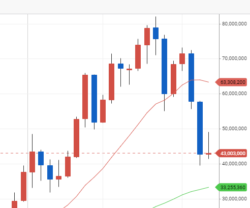
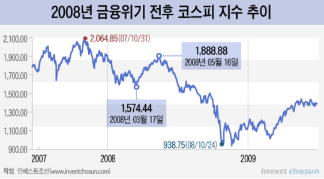
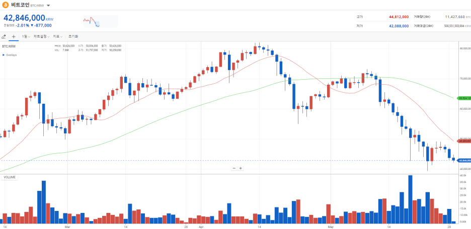
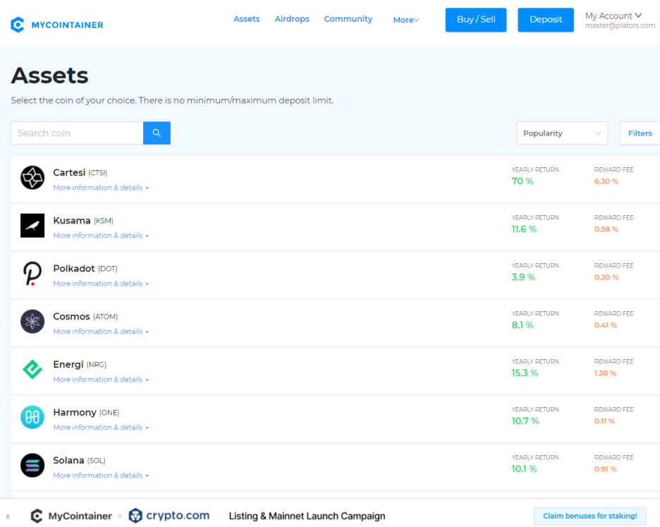
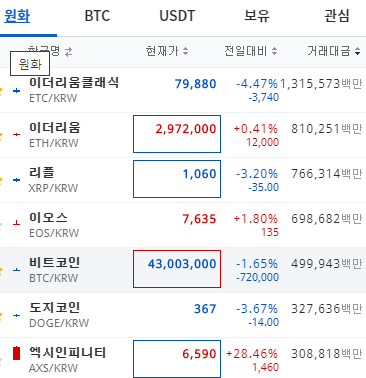

# 비트코인 하락장 대응전략

**하락하면 비로소 보이는 것들**

출처: https://plators.tistory.com/331

처음 이런 하락을 맛본 사람들은 말 그대로 멘붕일 것이다. 필자도 그랬다. 다리에 힘이 풀리고, 멘붕에 온갖 스트레스로 코인에 관한 건 뭐든지 들여다보기도 싫었다. 김치프리미엄을 자랑하는 국내 장에서도 비트코인 4천만원이 위협받는 상황에서는 더더욱 멘탈을 잡기 어렵다.

 

누가 하락장을 어떻게 대응하라고 알려줬다면 좋았을텐데 불행히도 필자 주변에는 그런 귀인들이 없었다. 그래서 지난 3년간의 하락장을 겪으며 나름 잘 대응한 것도 있고, 놓쳐서 후회하는 일도 생겼다. 그래서 몇 가지만 추려서 하락장 대응방법을 소개해보려 한다.

 

 

**일단 너무 걱정 말자.**

 

2000년대는 국내에서 펀드가 상당히 유행했었다. 펀드로 몇배를 벌었다는 이야기가 주변에 흔했다. 그래서 필자도 적금과 예금을 모조리 깨서 국내와 중국 펀드에 각각 가입했다. 그리고 2008년 서브프라인모기지 사태가 터졌다. 2천선이었던 주가는 1000아래로 떨어졌고, 시장은 공포에 얼어붙었다.

 

당시 이명박정부에서는 폭락한 주식시장을 보며 지금 주식을 사면 돈을 번다고 말했는데 당연히 대중의 반응은 싸늘했다. 그런 공포 속에서 주식을 사라고 하면 미친놈 취급을 받는 게 당연했다. 하지만 결론적으로 시장은 다시 올랐고, 장기적으로 2020년 코로나를 겪으며 오히려 코스피 3천선을 돌파했다. 자산가격은 결국 회복되고 오른다.

 

 

**비트코인에 대한 우려**

 

비트코인에 대한 걱정은 여전히 난무한다. 가장 기본적으로는 비트코인이 사라질 것이라는 공포부터 시작해 향후 이더리움에 추월당한다는 이야기 등등 비트코인을 향한 위협과 공포는 언제나 존재했다. 가격이 오르면 올라서 공포, 떨어지면 떨어져서 공포라 했다. 그런데 잠깐 생각해보자. 비트코인 하락하면 매수하겠다던 사람들 지금 다 어디 갔나?

 

비트코인을 저점 매수하겠다는 말은 사실 환상과도 같은 말이다. 지나고 나서야 할지 아무도 하락하는 비트코인을 보며 현재가 고점인지, 저점인지, 상승으로 돌아설지, 이대로 하락할지 알 수 없다. 그래서 비트코인은 항상 꾸준히 분할매수하는 것이다. 매월 조금씩이라도 매수하면 하락을 헷징하고, 미래를 대비할 수 있다. 넥슨이 비트코인 하락으로 20조원 손해를 보았다는 뉴스를 보며 너무 걱정하지 말자. 우리는 분할매수 하면 된다.

 

 

**가만히 있지 말자.**

 

하락한다고 스트레스를 피하기위해 아예 코인에 무관심해지는 사람들이 꽤 많다. 하지만 그래서는 안 된다. 지갑에 마이너스난 코인들이 가득해도 귀와 눈을 닫으면 말 그대로 시간을 버리는 셈이다. 이럴 때는 스테이킹이 가능한 코인의 경우 아예 스테이킹을 통해 이자농사를 짓는 것도 좋은 방법이다.

 

대부분의 스테이킹 서비스들이 최소 연 4%의 이자를 제공한다. 코인에 따라서는 스왑을 하면 10%가 넘는 이자를 제공하는 경우도 있다. 물론 스왑과 그에따른 수수료는 감수해야 한다. 어찌되었든 매일 쌓이는 이자를 보고있으면 실제 리스크를 줄이고, 상승시에는 레버리지를 일으키는 효과까지 얻을 수 있다. 지나치게 스테이킹 업체를 믿어서는 안 되지만 일부를 스테이킹하는 것은 필수다.

 

 

**급등하는 잡코인과 포트폴리오 정리**

 

시장이 침체되면 거래소 입장에서는 거래수수료가 줄어들기 때문에 어떻게 해서든 사람들을 거래소에 묶어두려 한다. 이 과정에서 거래량이 적은 코인들을 펌핑하는 경우가 종종 있다. 따라서 대세하락장에서 이상하리만큼 높은 상승을 보이는 코인들, 그중에서도 특히나 거래량이 적은 코인은 무시해야 한다.

 

손해를 만회해보겠다며 이런 듣보잡 코인에 들어가는 것은 매우 위험한 행동이다. 또한 내가 보유한 코인들의 프로젝트 상황을 잘 관찰해봐야 한다. 플립사이드크립토에서 신용도가 낮아거나 프로젝트 진행이 잘 되지 않고 있는 코인이라면 정리하고, 신뢰도 높은 프로젝트로 포트폴리오를 재편해 자금을 모는 것도 좋은 방법이다.

 

코인투자에서 가장 중요한 것은 돈을 따는 것이 아니라 잃지 않는 것이다. 지금 손실이 났다고 손절하지 말자. 스테이킹이라도 해서 버티자. 상승장은 반드시 다시 온다. 기다리지 못하는 사람들이 있을 뿐이다.